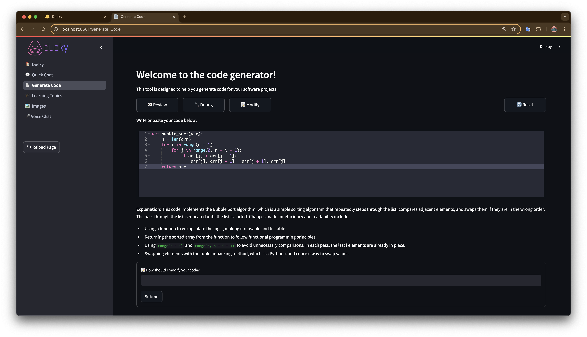

# Quick Chat 💬



Get instant answers to your software development and coding questions, now with image generation and voice message features.

## Description

Quick Chat is a Streamlit application that provides instant answers to your software development and coding queries. It leverages OpenAI's GPT models to generate responses. Additionally, you can use *The Pragmatic Programmer* book as context to enrich the answers.

**New Features:** Quick Chat now includes functionality for generating images based on your prompts and supports voice message dialogues for a more interactive experience.

## Features

- **Instant Q&A**: Ask any software development or coding question and receive immediate answers.
- **Image Generation**: Create images by entering descriptive prompts directly in the chat.
- **Voice Message Dialogues**: Engage in conversations using voice messages for hands-free interaction.
- **Pragmatic Programmer Context**: Optionally use *The Pragmatic Programmer* as additional context for more insightful responses.
- **Interactive Chat Interface**: User-friendly chat interface built with Streamlit.
- **Session Management**: Maintains conversation history during your session.

## Installation

### Prerequisites

- Python 3.7 or higher
- [pip](https://pip.pypa.io/en/stable/installation/)
- [Streamlit](https://streamlit.io/) library
- OpenAI API key (for accessing GPT models)

### Install Dependencies

Install the required Python packages:

```bash
pip install -r requirements.txt
```

## Usage

Run the Streamlit application:

```bash
streamlit run app.py
```

Open your web browser and navigate to `http://localhost:8501`.

### How to Use the Features

#### Asking Questions

1. Enter your software development or coding question in the chat input box at the bottom of the page.
2. To include *The Pragmatic Programmer* as context, check the **Use *The Pragmatic Programmer* as context** checkbox.
3. Press **Enter** to submit your question.

#### Generating Images

1. Navigate to the **Image Generation** section in the chat interface.
2. Enter a descriptive prompt of the image you want to generate.
3. Click on the **Generate Image** button to create and display the image.

#### Voice Message Dialogues

1. Go to the **Voice Messages** section.
2. Click on the **Record** button to start recording your voice message.
3. After recording, click **Send** to submit your voice message.
4. Receive responses in text or audio format as per your preference.

### Viewing Contextual Pages

If a specific page from *The Pragmatic Programmer* is referenced:

- An expandable section titled with the page number will appear.
- Click on it to view the page image from the book.

## Project Structure

```
quick-chat/
├── app.py
├── services/
│   ├── prompts.py
│   ├── image_generation.py
│   └── voice_messages.py
├── pages/
│   ├── 1_💬_Quick_Chat.py
│   ├── 2_📄_Generate_Code.py
│   ├── 3_🎓_Learning_Topics.py
│   ├── 4_🏞️_Images.py
│   └── 5_️🎤_Voice_Chat.py
├── helpers/
│   ├── util.py
│   └── sidebar.py
├── data/
│   ├── ThePragmaticProgrammer.pdf
│   ├── ThePragmaticProgrammer.embeddings.csv (optional)
│   └── images/ (for generated images)
├── requirements.txt
├── README.md
└── .env (optional)
```

*Note: Remember to replace `path/to/your/image.png` with the actual path to your image at the top of the README.*

## Additional Configuration

Ensure that your `.env` file includes the necessary API keys and configurations for OpenAI services, image generation, and voice processing functionalities.

## Contributing

Contributions are welcome! Please open an issue or submit a pull request for any improvements.

## License

This project is licensed under the MIT License. See the [LICENSE](LICENSE) file for details.